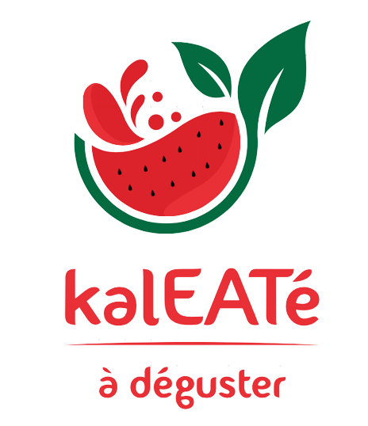
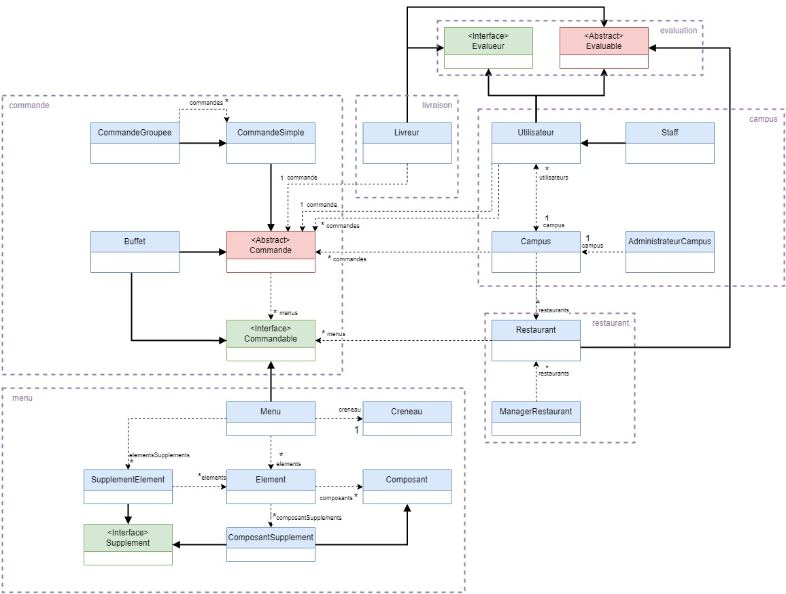

# SopiaTech Eats-Team-23-24

Équipe K - kalEATé <br>


---

## TEAM

Nous sommes une équipe composée de 5 développeurs : <a href="https://github.com/ClervieCauser">Clervie CAUSER</a>, <a href="https://github.com/benneuville">Benjamin NEUVILLE-BURGUIÈRE</a>, <a href="https://github.com/RomainPellegrini">Romain PELLEGRINI</a>, <a href="https://github.com/JulienS0t0">Julien SOTO</a> et <a href="https://github.com/CarlaWagschal1">Carla WAGSCHAL</a>.

Un rôle a été attribué à chacun :
- Product Owner (PO) : <a href="https://github.com/CarlaWagschal1">Carla WAGSCHAL</a>
- Architect Logiciel (SA) : <a href="https://github.com/benneuville">Benjamin NEUVILLE-BURGUIÈRE</a>
- Assureur de Qualité (QA) : <a href="https://github.com/RomainPellegrini">Romain PELLEGRINI</a> et <a href="https://github.com/JulienS0t0">Julien SOTO</a>
- Intégration Continue et Manager de Répertoire (Ops) : <a href="https://github.com/ClervieCauser">Clervie CAUSER</a>

---

## doc
Avant de commencer à coder nous nous sommes familiarisés avec le sujet et nous avons réalisé un <a href="https://github.com/PNS-Conception/ste-23-24-equipe-k-kaleate/blob/main/doc/RapportTD1TD2-EquipeK.pdf">premier rapport</a> qui met en avant nos hypothèses et compréhension du sujet ainsi que nos différents diagrammes.
Dans notre dernier rapport, nous avons conclue sur le projet ainsi que fait une rétrospective.

## src
 - pom.xml :
   - Cucumber 7 et JUnit 5
   - JDK 17
   - Picocontainer 2.15
   - Mokito 4.8.1
   - Picoli 4.7.0
 
---

## Ce que fait notre projet

### Principales User stories
Nous avons procédé de sorte qu'une Milestone corresponde à une User Story. Vous trouverez en description d'une milestone les différents scénarios d'une User Story. Dans chaque Milestone, nous avons les tests associés à la User Story. Les fichiers cucumber portent le nom de la User Story qu'elle teste.
Voici une liste de nos User story et leurs références dans notre code :
- **Milestone 1** : <a href="https://github.com/PNS-Conception/ste-23-24-equipe-k-kaleate/milestone/3"> US1 : créer une commande simple</a>

_**Un exemple d'un scénario traité dans cette User Story:**_
```
    En tant qu'utilisateur,
    Je veux sélectionner un menu
    Afin de créer une commande simple
```
- **Milestone 2** : <a href="https://github.com/PNS-Conception/ste-23-24-equipe-k-kaleate/milestone/4">US2 : valider une commande en tant que restaurateur</a>
- **Milestone 3** : <a href="https://github.com/PNS-Conception/ste-23-24-equipe-k-kaleate/milestone/5">US8 : ajouter des restaurants et des utilisateurs en tant qu'administrateur campus</a>
- **Milestone 4** : <a href="https://github.com/PNS-Conception/ste-23-24-equipe-k-kaleate/milestone/6">US13 : Choisir une commande à livrer en tant que livreur</a>
- **Milestone 5** : <a href="https://github.com/PNS-Conception/ste-23-24-equipe-k-kaleate/milestone/7">US5 : Ajouter, Modifier et Supprimer des Menus en tant que restaurateur</a>
- **Milestone 6** : <a href="https://github.com/PNS-Conception/ste-23-24-equipe-k-kaleate/milestone/8">US3 : faire une commande groupée</a>
- **Milestone 7** : <a href="https://github.com/PNS-Conception/ste-23-24-equipe-k-kaleate/milestone/9">US16 : Diversités des menus</a>
- **Milestone 8** : <a href="https://github.com/PNS-Conception/ste-23-24-equipe-k-kaleate/milestone/10">US10 : commande prête à la livraison</a>
- **Milestone 9** : <a href="https://github.com/PNS-Conception/ste-23-24-equipe-k-kaleate/milestone/11">US7 : payer</a>
- **Milestone 10** : <a href="https://github.com/PNS-Conception/ste-23-24-equipe-k-kaleate/milestone/12"> US14 : valider la récupération de la commande par le livreur</a>
- **Milestone 11** : <a href="https://github.com/PNS-Conception/ste-23-24-equipe-k-kaleate/milestone/13"> US12 : déterminer un rayon et le centre autour de mon campus</a>
- **Milestone 12** : <a href="https://github.com/PNS-Conception/ste-23-24-equipe-k-kaleate/milestone/14">US4 : livraison de la commande au client</a>
- **Milestone 13** : <a href="https://github.com/PNS-Conception/ste-23-24-equipe-k-kaleate/milestone/15">US24 : récupérer les informations de ma commande après avoir payé</a>
- **Milestone 14** : <a href="https://github.com/PNS-Conception/ste-23-24-equipe-k-kaleate/milestone/16">US6 : le restaurant annule une commande</a>
- **Milestone 15** : <a href="https://github.com/PNS-Conception/ste-23-24-equipe-k-kaleate/milestone/17">US17 : système d'évaluation</a>
- **Milestone 16** : <a href="https://github.com/PNS-Conception/ste-23-24-equipe-k-kaleate/milestone/18">US9 : Manager modifie les horaires</a>
- **Milestone 17** : <a href="https://github.com/PNS-Conception/ste-23-24-equipe-k-kaleate/milestone/19">US18 : Modification d'un menu par le Manager de Restaurant</a>
- **Milestone 18** : <a href="https://github.com/PNS-Conception/ste-23-24-equipe-k-kaleate/milestone/20">US25 : réduction d'une commande</a>
- **Milestone 19** : <a href="https://github.com/PNS-Conception/ste-23-24-equipe-k-kaleate/milestone/21">US19 : Suppression d'un menu par le Manager de Restaurant</a>
- **Milestone 20** : <a href="https://github.com/PNS-Conception/ste-23-24-equipe-k-kaleate/milestone/22"> US20 : Supprimer dans un menu pour un utilisateur</a>
- **Milestone 21** : <a href="https://github.com/PNS-Conception/ste-23-24-equipe-k-kaleate/milestone/23">US21 : Modifier un menu pour un utilisateur</a>
- **Milestone 22** : <a href="https://github.com/PNS-Conception/ste-23-24-equipe-k-kaleate/milestone/24">US22 : Abandon d'un commande par un utilisateur</a>
- **Milestone 23** : <a href="https://github.com/PNS-Conception/ste-23-24-equipe-k-kaleate/milestone/25">US4 : historique de commande + tendance restaurant</a>
- **Milestone 24** : <a href="https://github.com/PNS-Conception/ste-23-24-equipe-k-kaleate/milestone/26">Commande Buffet</a>

---
## Comment lancer le projet et l'installer

Pour installer le projet il suffit d'exécuter la commande :
 <br/>
``` git clone 'https://github.com/PNS-Conception/ste-23-24-equipe-k-kaleate.git' ```
 <br/>
Pour lancer le projet il suffit d'exécuter la commande :
 <br/>
``` mvn clean install ```

---

## Structure du projet


---
